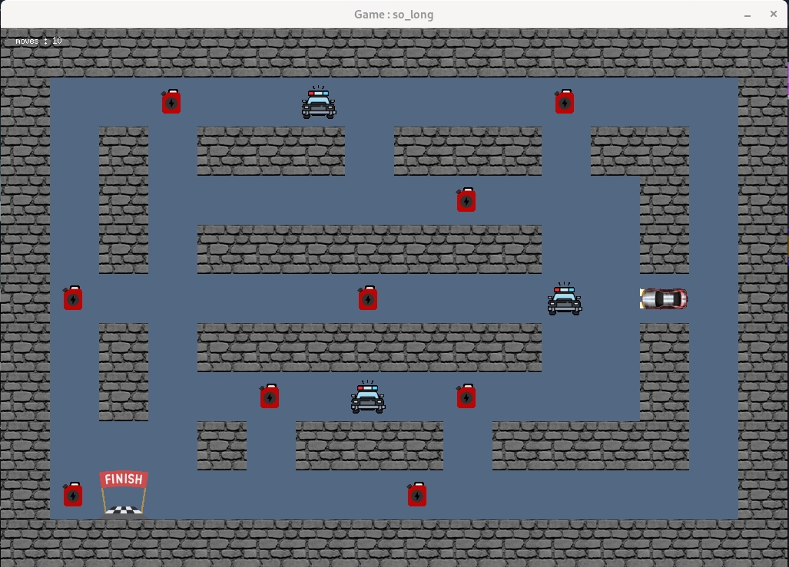

# so_long

This repository contains my implementation of the **so_long** project from 42 School. The project consists of building a simple 2D game using the MiniLibX graphics library, where the player collects coins and exits the map while respecting specific constraints.

---
## Project Overview

- **Library**: MiniLibX (simple graphics library)
- **Gameplay**: Collect all items and reach the exit
- **Map**: 2D rectangular grid loaded from a `.ber` file
- **Objective**: Validate and render maps, handle input, and manage player movement
- **Constraints**: Wall-surrounded maps, valid characters, and no memory leaks

---

## Features

- Movement using `W`, `A`, `S`, `D` and arrows keys
- Collectibles must be gathered before the exit is usable
- Player cannot walk through walls
- Basic enemy support (optional)
- Move counter printed in terminal
- Input map validation:
  - Must contain at least 1 player, 1 exit, and 1 collectible
  - Map must be closed and rectangular
  - Only valid characters allowed: `0`, `1`, `P`, `E`, `C`

---

## Installation & Usage

### 1. Clone the repository

```bash
git clone https://github.com/moirhira/so_long.git
cd so_long
```

### 2. -> Compile the game (mandatory part)
```bash
make
```

### 2. -> Compile the game (bonus part)
```bash
make bonus
```

### 3. Run the game
```bash
./so_long maps/map1.ber
```
### 
### Author
mohamed irhiralla (moirhira) – GitHub Profile
